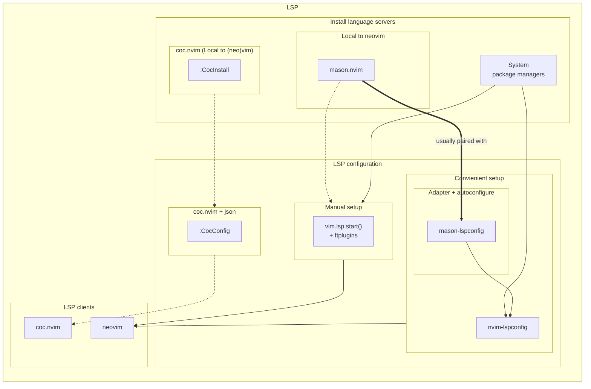

# Notes
This file will contain some useful information about Nvim and Lua!


## Protected calls
You would have seen below code snippet.
```
local status_ok, configs = pcall(require, "pluginname")
if not status_ok then
  return
else
  -- Do something
end
```

How do you get this 'pluginname' if you didn't it from the documentation?
Remember it is not always the directory name or the git repo name.

Ok, so here is how to get it in case where repo name or directory name doesn't
work. Inside nvim, type
```
: set rtp?
```

It will show the runtime path of all the plugins. These can be used for those
protected calls.


## Pretty cool websites
https://github.com/rockerBOO/awesome-neovim

https://neovimcraft.com

https://dotfyle.com

## Understanding Neovim LSP

